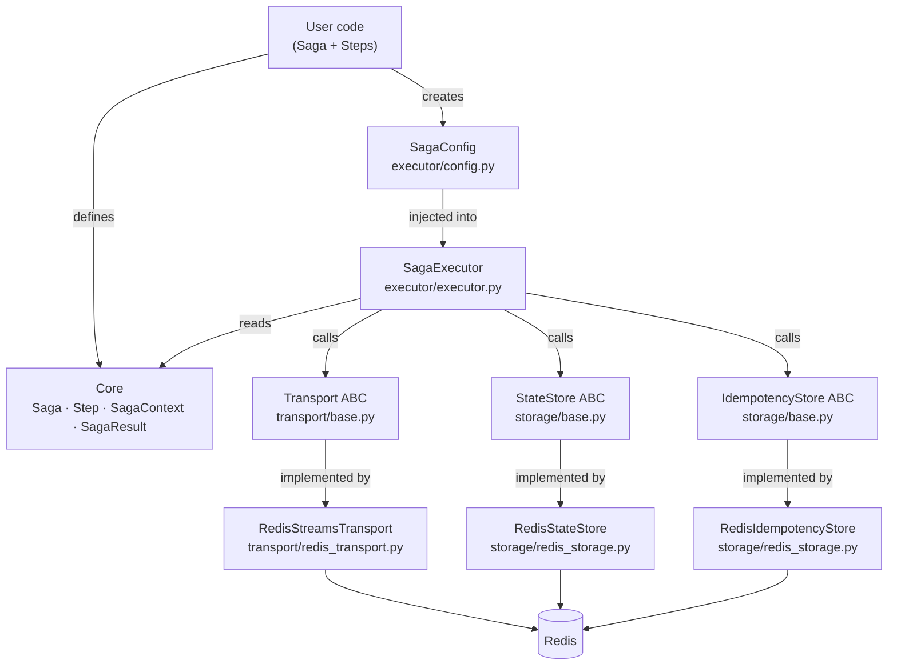

# Architecture

## Component diagram



---

## Components

### `sagakit.core`

Pure domain objects with no I/O dependencies.

- **`Saga[T]`** — an ordered list of forward `Step` objects plus an optional
  list of `compensations`. Validates compensation references at construction
  time and warns about forward steps that cannot be rolled back.
- **`Step`** — immutable wrapper around an async function. Carries the
  function reference, its name, and an optional `compensate_name` string
  pointing to a step in the same saga.
- **`SagaContext[T]`** — frozen context passed to every step and compensation
  handler. Exposes `saga_id`, `step_name`, `attempt_number`,
  `idempotency_key`, `saga_input`, accumulated `step_results`, `metadata`,
  and a structlog `BoundLogger` pre-bound with saga and step identifiers.
- **`SagaResult`** — frozen terminal record: `status`, `step_results`,
  `failed_step`, `compensated_steps`, `error`.
- **`SagaStatus`** — `StrEnum` with values `completed`, `compensated`,
  `failed`.

### `sagakit.executor`

Connects core objects to the infrastructure layer.

- **`SagaConfig`** — dataclass grouping `Transport`, `StateStore`,
  `IdempotencyStore`, and retry / TTL tuning knobs. Passed to `SagaExecutor`
  at construction time.
- **`SagaExecutor[T]`** — the execution engine. The single public method
  `execute(saga, payload)` drives the full lifecycle: idempotency check,
  step invocation, state persistence, retry with exponential backoff and
  jitter, and reverse compensation on failure.

### `sagakit.transport`

Message delivery abstraction.

- **`Transport`** (ABC) — declares `initialize`, `publish`, `consume`,
  `acknowledge`, `reject`.
- **`RedisStreamsTransport`** — Redis Streams consumer group implementation.
  `publish` appends to a stream; `consume` blocks on `XREADGROUP` and yields
  `Message` objects; `reject(requeue=False)` moves a message to
  `{stream}:dlq`.

### `sagakit.storage`

Persistence abstractions.

- **`StateStore`** (ABC) — `save`, `load`, `delete` for saga state.
- **`IdempotencyStore`** (ABC) — atomic `set_processing` (SET NX EX),
  `set_completed`, `set_failed`, `get_status`.
- **`RedisStateStore`** — stores each saga as a Redis hash keyed by
  `sagakit:state:{saga_id}`. Values are JSON-serialised.
- **`RedisIdempotencyStore`** — uses Redis string keys
  `sagakit:idempotency:{key}` with NX + EX for atomic claim semantics.

---

## Data flow: a single saga execution

```
User calls SagaExecutor.execute(saga, payload)
  │
  ├─ Generate saga_id (UUID4 hex)
  │
  └─ For each step in saga.steps:
       │
       ├─ Build SagaContext (idempotency_key = "{saga_id}:{step_name}")
       │
       ├─ IdempotencyStore.set_processing(key, ttl)
       │    ├─ Returns False → step already done by another worker
       │    │    └─ Load result from StateStore, continue to next step
       │    └─ Returns True → this worker owns the step
       │
       ├─ Invoke step.fn(ctx)
       │    ├─ Success →
       │    │    ├─ IdempotencyStore.set_completed(key)
       │    │    ├─ StateStore.save(saga_id, {step_name: result})
       │    │    └─ Continue to next step
       │    └─ Exception →
       │         ├─ IdempotencyStore.set_failed(key)
       │         ├─ Retries left? → exponential backoff + jitter → retry
       │         └─ Retries exhausted → enter compensation
       │
       └─ (if all steps succeed) → return SagaResult(COMPLETED)

Compensation (triggered when a step exhausts retries):
  │
  └─ For each completed step in REVERSE order:
       │
       ├─ Look up compensate_name in saga.steps + saga.compensations
       │    └─ Not found → log warning, skip
       │
       ├─ Run compensation step via _run_step (same retry logic)
       │    ├─ Success → record in compensated_steps
       │    └─ Retries exhausted →
       │         ├─ Log ERROR with full context
       │         └─ Mark saga status as FAILED (not COMPENSATED)
       │
       └─ Continue compensating remaining steps regardless
```

---

## Key design patterns

### Saga (orchestrated)

Each saga instance is driven by a single `SagaExecutor`. There is no
choreography — no step emits an event that triggers the next step. This
makes execution flow explicit and debuggable. See
[ADR 001](docs/adr/001-why-sagas-over-2pc.md).

### Idempotent Consumer

Before invoking a step, the executor atomically claims an idempotency key
using Redis `SET NX EX`. If the key is already claimed (a duplicate delivery
or a competing worker), the step is skipped and its result is loaded from the
state store. This is the standard Idempotent Consumer pattern applied to
saga steps. See [ADR 003](docs/adr/003-idempotency-strategy.md).

### Dead Letter Queue

When a compensation handler exhausts all retry attempts, the failure is
written to a dedicated DLQ stream (`sagakit:dlq:{saga_id}`) via the
`Transport` layer and a structured ERROR log is emitted. sagakit does not
stop compensating — it continues in reverse order for the remaining steps.
See [ADR 004](docs/adr/004-compensation-semantics.md).

### Transport abstraction

`Transport` is an ABC, not a concrete class. In v1 the only implementation is
`RedisStreamsTransport`, but the interface is intentionally narrow so that a
RabbitMQ, Kafka, or Azure Service Bus transport can be added without touching
the executor or storage layers. See
[ADR 002](docs/adr/002-redis-streams-as-default-transport.md).
