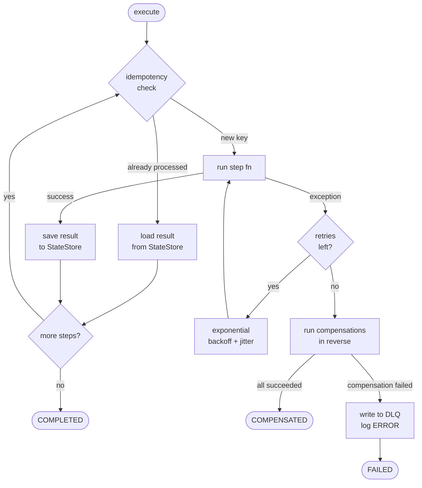

# sagakit

[](https://github.com/diegogue88/sagakit/actions/workflows/ci.yml)

sagakit is a focused Python library for orchestrating distributed transactions
using the **Saga pattern**. It targets Python backend engineers who need
durable, compensable multi-step workflows — payment flows, inventory
reservations, order pipelines — without adopting a full workflow engine like
Temporal. Each step declares an explicit compensation handler; if a later step
fails, sagakit runs them in reverse order. Idempotency, retries with
exponential backoff, and structured logging are built in.

> **Status: pre-alpha — under active development. Not ready for production use.**

---

## Quick start

```bash
# 1. Start Redis
docker compose up -d

# 2. Install
pip install sagakit   # not yet published — clone and: uv sync

# 3. Run the order-processing example
uv run python -m examples.order_processing.run

# 4. Simulate a failure
FAIL_AT_STEP=ship_order uv run python -m examples.order_processing.run
```

```python
import asyncio
import redis.asyncio as aioredis
import structlog
from sagakit import (
    Saga, SagaConfig, SagaContext, SagaExecutor, SagaStatus,
    RedisStreamsTransport, RedisStateStore, RedisIdempotencyStore,
    step,
)

@step(compensate="refund_payment")
async def charge_payment(ctx: SagaContext) -> dict:
    return {"payment_id": f"pay_{ctx.saga_id[:8]}"}

@step(compensate="release_inventory")
async def reserve_inventory(ctx: SagaContext) -> dict:
    return {"reservation_id": f"res_{ctx.saga_id[:8]}"}

@step
async def ship_order(ctx: SagaContext) -> dict:
    return {"tracking_id": f"trk_{ctx.saga_id[:8]}"}

@step
async def refund_payment(ctx: SagaContext) -> dict:
    return {"refunded": True}

@step
async def release_inventory(ctx: SagaContext) -> dict:
    return {"released": True}

async def main() -> None:
    client = aioredis.from_url("redis://localhost:6379")
    config = SagaConfig(
        transport=RedisStreamsTransport(client),
        state_store=RedisStateStore(client),
        idempotency_store=RedisIdempotencyStore(client),
    )
    saga = Saga(
        name="order_saga",
        steps=[charge_payment, reserve_inventory, ship_order],
    )
    result = await SagaExecutor(config).execute(saga, {"order_id": "ord-001", "amount": 99.99})
    print(result.status)   # "completed", "compensated", or "failed"
    await client.aclose()

asyncio.run(main())
```

---

## Why sagakit

- **Zero broker overhead.** One `docker run redis` is the entire infrastructure requirement. No Zookeeper, no broker configuration, no schema registry. A developer can have a working saga running in under 30 minutes.
- **Synchronous-feeling async API.** `await executor.execute(saga, payload)` — no polling, no callbacks, no separate worker process to manage. Your saga runs and returns a result like any other async function.
- **Built-in idempotency.** Every step gets a stable idempotency key across retries. Double-charging a payment or double-sending an email — the most common distributed systems bug — is prevented by default.
- **State survives restarts.** Saga state is persisted in Redis on every step completion. With AOF persistence enabled, in-flight sagas resume where they left off after a process restart.
- **Explicit compensation.** Every step declares its own undo handler. When something fails, sagakit runs compensations in reverse order automatically — no manual cleanup code scattered across your codebase.

## When NOT to use sagakit

- **High-throughput systems (100+ sagas/second).** sagakit performs multiple Redis operations per step (idempotency check, state save, stream publish). Single-node Redis handles this well at moderate load, but sagakit has not been benchmarked at sustained high throughput. If you need that scale, measure first — or consider a Kafka-backed solution.
- **Long-running workflows (hours or days).** `executor.execute()` is a single async call that runs to completion. A saga waiting for a human approval step that takes two days is not a good fit. For workflows with human-in-the-loop steps or multi-day durations, use Temporal or a purpose-built workflow engine.
- **Workflows with parallel steps.** sagakit executes steps in strict sequence. If you need two steps to run concurrently — notify the warehouse and send a confirmation email at the same time — sagakit does not support that in v1. Use it when your workflow is naturally sequential with 3 or more steps that each need compensation.

---

## How it works



---

## Architecture decisions

| ADR | Decision |
|-----|----------|
| [001 — Why sagas over 2PC](docs/adr/001-why-sagas-over-2pc.md) | Sagas chosen over two-phase commit for distributed transactions |
| [002 — Redis Streams as default transport](docs/adr/002-redis-streams-as-default-transport.md) | Redis Streams as the v1 message transport |
| [003 — Idempotency strategy](docs/adr/003-idempotency-strategy.md) | Shared-responsibility model with Redis atomic SET NX |
| [004 — Compensation semantics](docs/adr/004-compensation-semantics.md) | Retry then DLQ; compensation is semantic undo, not physical rollback |

Full architecture overview: [ARCHITECTURE.md](ARCHITECTURE.md)

---

## Development

```bash
# Start dependencies
docker compose up -d

# Install dev dependencies
uv sync

# Unit tests (no Docker required)
uv run pytest tests/unit/ -v

# Integration tests (requires Redis)
uv run pytest -m integration

# Type check
uv run mypy --strict src/

# Lint + format
uv run ruff check src/ tests/
uv run ruff format src/ tests/
```

---

## License

MIT. See [LICENSE](LICENSE).
